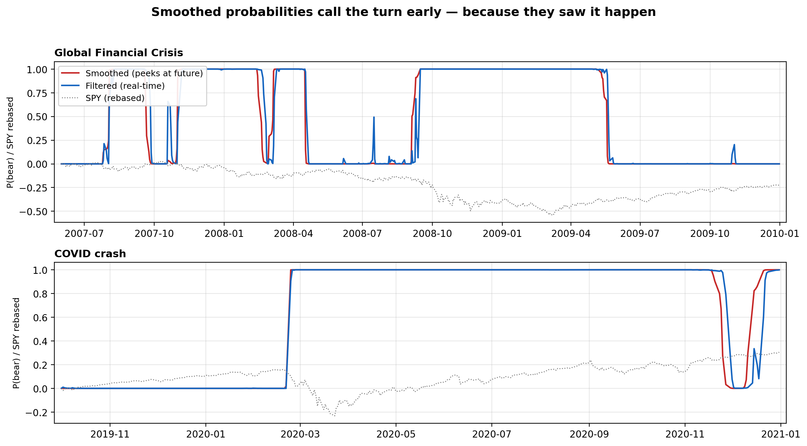

# Hidden Markov Model Market-Regime Engine

**Most HMM trading backtests published online are accidentally look-ahead biased. This project measures exactly how much performance that bias fabricates — then reports what survives when it's removed.**

*Smoothed probabilities (red) call the 2008 and 2020 turns almost perfectly — because they condition on the full sample, including the future. Filtered probabilities (blue) are what you could actually have known on the day. The visible lag between them is look-ahead bias, made visual.*

---

## The headline result: honesty costs Sharpe

Same model family, same allocation rule, same costs — each row tightens the information discipline:

| Information discipline | Sharpe |
|---|---|
| Smoothed probabilities (backward pass sees the future) | **0.93** |
| Filtered probabilities (real-time inference, but parameters fit on full sample) | **0.76** |
| Full walk-forward (annual refits on past data only, filtered inference, 2005–2026 OOS) | **0.59** |

The first gap (−0.17 Sharpe) is fabricated purely by the smoother's backward pass; filtered and smoothed labels disagree on only 2.3% of days, yet those days — regime turning points — are where all the money is. The second gap adds parameter honesty. Most online HMM backtests report the first row and call it a strategy.

## What this project does

A Gaussian HMM is fit to five features — S&P 500 returns, 21-day realized volatility, VIX, Baa credit spreads, and the 10y–3m curve slope (all standardized with expanding-window statistics lagged one day, because full-sample z-scoring is itself a leak) — identifying three regimes: calm bull, transition, volatile bear. A probability-blended allocation across **SPY / TLT / GLD** shifts from 90% equities in the calm regime toward 60% Treasuries + 20% gold in the stressed regime, inferred with a **hand-implemented forward filter** (hmmlearn only exposes smoothed posteriors), traded with a one-day lag and 5 bps costs.

## Out-of-sample performance (2005–2026, net of costs)

| | CAGR | Ann. Vol | Sharpe | Max Drawdown |
|---|---|---|---|---|
| HMM regime strategy | 5.8% | 10.5% | 0.59 | **−31.0%** |
| SPY buy & hold | 11.0% | 19.0% | 0.65 | −55.2% |
| 60/40 (SPY/TLT) | 8.7% | 11.1% | 0.80 | −29.9% |

**Where the regime signal earns its keep — volatility-driven crises:**

| Crisis window | HMM strategy | SPY | 60/40 |
|---|---|---|---|
| GFC (Oct 07 – Mar 09) | **−10.1%** | −46.0% | −20.5% |
| COVID crash (Feb – Apr 20) | **+6.1%** | −13.2% | −0.9% |
| 2022 rate shock | −23.5% | −18.2% | −22.8% |

**An honest reading:** the strategy delivers dramatic protection in volatility-driven crashes (2008, 2020) but *fails in 2022*, when Treasuries fell alongside equities — the regime signal correctly detected stress, but the "defensive" assets weren't defensive. The baseline also does not beat 60/40 on full-period Sharpe. The robustness grid (state count, refit frequency, feature ablations) shows neighboring configurations scoring 0.70–0.88 Sharpe, meaning the baseline is on the *weak* end of its own neighborhood — reported as-is rather than swapping in a better-performing configuration after the fact, which would be selection bias of exactly the kind this project exists to avoid.

## Repo contents

- `hmm_regime_engine.ipynb` — full pipeline: data (Yahoo Finance + FRED, no API keys), BIC model selection, regime anatomy, the look-ahead demonstration, walk-forward backtest, sensitivity grid. Runs top-to-bottom in Google Colab in ~10 minutes.

## Honest limitations

Regime count, features, and allocation endpoints were chosen on the same history used for evaluation (residual selection bias); Gaussian emissions understate tails; the SPY/TLT/GLD universe embeds hindsight about which assets hedged past crises — 2022 is the counterexample; costs are flat 5 bps with no impact modeling; annualized turnover is 6.4x, so realized frictions matter; results are a single historical path with no bootstrap significance testing. Next extensions: statistical jump models (more stable regime paths), time-varying transition probabilities driven by the yield curve, and block-bootstrap confidence intervals on Sharpe differences.

## Stack

Python · hmmlearn · pandas · NumPy · SciPy · scikit-learn · Plotly · yfinance · FRED

---

*Woojoon Shim — NYU Stern '29 · [LinkedIn](https://www.linkedin.com/in/shim-w-joon)*
